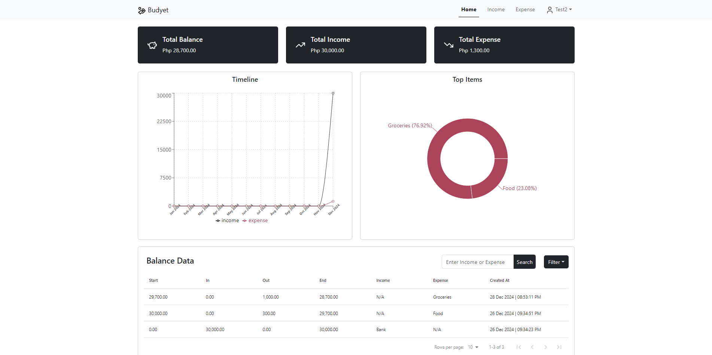

# Budyet App

A budyet, income, and expense monitoring app with analytics dashboard built in MERN stack.



## Development
In backend and frontend run `npm run dev`

## Deployment

Requirements:
1. AWS EC2 for virtual server
2. DuckDNS for free subdomain (you can use whatever domain provider)
3. Certbot tool to obtain and manage free SSL certificates from Let's Encrypt

### Production setup
1. Create `.env` file both frontend and backend
2. Run `npm install` both frontend and backend
3. From frontend, run `npm run build`
4. Install PM2 `npm install -g pm2` for process management, we will run the app as process.
5. From backend run `pm2 start server.js` then `pm2 save --force`;

### For DuckDNS
After signup and add subdomain update the ip address to ip of your server, to get the ip address:
```
curl ifconfig.me
```

### HTTPS setup
1. Update your system's package manager:
```
sudo apt update 
sudo apt install software-properties-common
```
2. Install Certbot and the NGINX plugin:
```
sudo apt install certbot python3-certbot-nginx
```
3. Ensure ports 80 (HTTP) and 443 (HTTPS) are open. For UFW (Uncomplicated Firewall) and verify:
```
sudo ufw allow 'Nginx Full'
sudo ufw delete allow 'Nginx HTTP'
sudo ufw status
```
4. Obtain SSL certificate, Run Certbot to automatically fetch and configure SSL for your domain:
```
sudo certbot --nginx -d <yourdomain.org>
```
5. Configure NGINX:
> Note: this app is using cookies so it might be different in other setups but for now this configuration is working.
```
server {
    listen 443 ssl;
    server_name <yourdomain.com>;

    # SSL Configuration
    ssl_certificate /etc/letsencrypt/live/<yourdomain.com>/fullchain.pem;
    ssl_certificate_key /etc/letsencrypt/live/<yourdomain.com>/privkey.pem;
    include /etc/letsencrypt/options-ssl-nginx.conf;
    ssl_dhparam /etc/letsencrypt/ssl-dhparams.pem;

    # Security headers
    add_header Strict-Transport-Security "max-age=31536000; includeSubDomains" always;
    add_header X-Frame-Options "SAMEORIGIN" always;
    add_header X-Content-Type-Options "nosniff" always;
    add_header X-XSS-Protection "1; mode=block" always;

    location / {
        proxy_pass http://localhost:3001;
        proxy_http_version 1.1;
        proxy_set_header Upgrade $http_upgrade;
        proxy_set_header Connection 'upgrade';
        proxy_set_header Host $host;
        proxy_set_header X-Real-IP $remote_addr;
        proxy_set_header X-Forwarded-For $proxy_add_x_forwarded_for;
        proxy_set_header X-Forwarded-Proto $scheme;
        proxy_cache_bypass $http_upgrade;

        # Cookie handling
        proxy_cookie_path / "/; secure; SameSite=None";
        proxy_set_header Cookie $http_cookie;

        # CORS headers
        add_header 'Access-Control-Allow-Origin' '<yourdomain.com>' always;
        add_header 'Access-Control-Allow-Credentials' 'true' always;
        add_header 'Access-Control-Allow-Methods' 'GET, POST, PUT, DELETE, OPTIONS' always;
        add_header 'Access-Control-Allow-Headers' 'DNT,User-Agent,X-Requested-With,If-Modified-Since,Cache-Control,Content-Type,Range,Authorization' always;

        # Handle preflight requests
        if ($request_method = 'OPTIONS') {
            add_header 'Access-Control-Allow-Origin' '<yourdomain.com>' always;
            add_header 'Access-Control-Allow-Credentials' 'true' always;
            add_header 'Access-Control-Allow-Methods' 'GET, POST, PUT, DELETE, OPTIONS' always;
            add_header 'Access-Control-Allow-Headers' 'DNT,User-Agent,X-Requested-With,If-Modified-Since,Cache-Control,Content-Type,Range,Authorization' always;
            add_header 'Access-Control-Max-Age' 1728000;
            add_header 'Content-Type' 'text/plain; charset=utf-8';
            add_header 'Content-Length' 0;
            return 204;
        }
    }

    # Redirect HTTP to HTTPS
    listen 80;
    if ($scheme != "https") {
        return 301 https://$host$request_uri;
    }
}
```
6. Restart NGINX:
```
sudo systemctl restart nginx
```